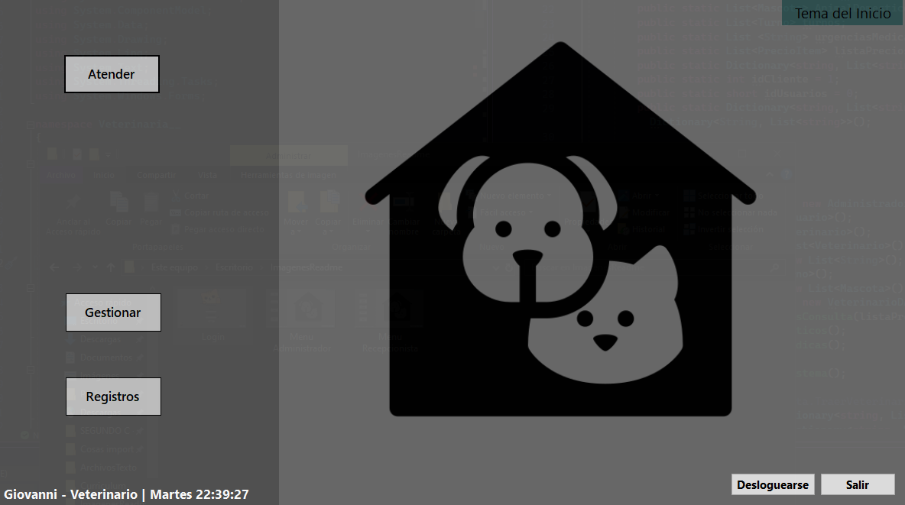

# **Veterinaria**

Aplicacion para un sistema de Veterinaria desarrollada por Giovanni Lucchetta. Si desea ver las consigas de este trabaja puede ingresar al [Enunciado](https://docs.google.com/document/d/1goHCF5AzQE_yP2rqEd3bpyyg3FjWshRw0BmN7tP6upo/edit?usp=sharing).

## Sobre mi:
Hola, soy Giovanni Lucchetta estudiante en Tecnico Universitario en Programacion (UTN-FRA). Disfrute mucho este trabajo, fue un desafio tener que entender e investigar como plantear el funcionamiento de la administracion de una Veterinaria, con esto aprendi las diferentes posturas para resolver un mismo problema utilizando todos los conceptos de la Programación Orientada a Objetos.

## **Resumen**
Al correr la apliacion se presenta con una venta para realizar el **Log In**. 

En el cual se le pedira al usuario ingresar su **Nombre de Usuario** y **Contraseña**. El _Nombre de Usuario_ debera ser unico y no repetirse con los demas usuarios, y la _Contraseña_ debera tener un largo de por lo menos ocho digitos, contener una minuscula, una mayuscula, un numero y un simbolo.

Esta ventana consta con tres botones:
* **Entrar** : Verificando los campos ingresados, ingresara al **Menu Principal** de la apliacion, caso contrario informara un mensaje con el _error_
* **Icono Admin** _(Autocompletar)_ : Autocompleta los campos _Usuario_ y _Contraseña_ con datos validos para el facil acceso.
* **Ojo** _(Ocultar)_ : Alterna la visibilidad del campo _Contraseña_.
* **Salir** _(Salir)_ : Cerrara la ventanta y terminara con la aplicacion.

### **Menu Principal**
El programa cuenta con 3 tipos de usuarios diferentes que tienen acceso al programa.
Siendo estos:

* Administrador
* Recepcionista
* Veterinario

### **Feature general menues**:

* Display de Nombre de usuario, cargo dentro del programa, dia y horario.

* Todas los perfiles cuentan con botón para cambiar el tema, ya sea tema claro o oscuro, este cambia el estilo de la aplicación en cada una de sus pestañas persistiendo esta configuración en un archivo Json.

* Boton Desloguarse para poder cambiar de usuario o perfil si es requerido.

* Boton salir para salir de la aplicación.

### **Menu Principal Administrador**

El administrador tiene la responsabilidad de:

* Crear los empleados en el sistema.
* Modificar cualquier dato que este posea en el sistema.
* Darles una baja LOGICA del sistema, sin quitarlos completamente.
* Cambiar de base de datos entre SQL Server y Firebase.

### **Menu Principal Recepcionista**

El rol "mas importante" lo tiene el recepcionista en cierto sentido, esto es porque es el encargado de que poder crear los turnos dentro de la entidad.

* **Nuevo Turno**:
  Para crear un nuevo turno debemos seleccionár la fecha, para esto tendremos un selector de 
  calendario desde el dia de la fecha.
  

  Luego de haber seleccionado la fecha se da paso a la selección de Mascota, si esta se 
  encuentra dentro del sistema entonces se podra ubicar con su identificación la cual, el dueño 
  deberá saber, o el nombre de la mascota y apellido del dueño.

  En caso de que esta mascota no exista hay un botón que permite darla de alta y luego volver a   esta misma ventana.

  Luego se pasa a detallar el malestar de la mascota y hay dos posibilidades.

  **Dicho Malestar no está registrado en el sistema**
  
  Si el malestar no fue ingresado previamente se guardara en un archivo para que luego con solo   ingresar ese malestar, se auto asigne su 
  importancia y de **"estar disponible"** un medico   
  calificado **(segun su especialidad registrada en el sistema)** para tratar dicho malestar.

  

  
  

### **Menu Principal Veterinario**

