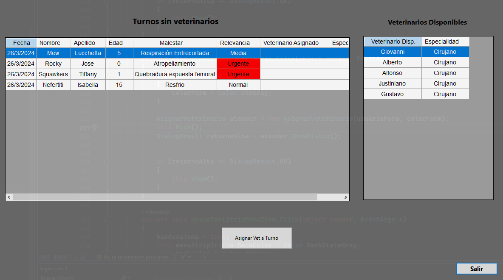

# **Veterinaria**

Aplicacion para un sistema de Veterinaria desarrollada por Giovanni Lucchetta. Si desea ver las consigas de este trabaja puede ingresar al [Enunciado](https://docs.google.com/document/d/1goHCF5AzQE_yP2rqEd3bpyyg3FjWshRw0BmN7tP6upo/edit?usp=sharing).

## Sobre mi:
Hola, soy Giovanni Lucchetta estudiante en Tecnico Universitario en Programacion (UTN-FRA). Disfrute mucho este trabajo, fue un desafio tener que entender e investigar como plantear el funcionamiento de la administracion de una Veterinaria, con esto aprendi las diferentes posturas para resolver un mismo problema utilizando todos los conceptos de la Programación Orientada a Objetos.

## **Resumen**
Al correr la apliacion se presenta con una venta para realizar el **Log In**. 

En el cual se le pedira al usuario ingresar su **Nombre de Usuario** y **Contraseña**. El _Nombre de Usuario_ debera ser unico y no repetirse con los demas usuarios, y la _Contraseña_ debera tener un largo de por lo menos ocho digitos, contener una minuscula, una mayuscula, un numero y un simbolo.

Esta ventana consta con tres botones:
* **Entrar** : Verificando los campos ingresados, ingresara al **Menu Principal** de la apliacion, caso contrario informara un mensaje con el _error_
* **Icono Admin** _(Autocompletar)_ : Autocompleta los campos _Usuario_ y _Contraseña_ con datos validos para el facil acceso.
* **Ojo** _(Ocultar)_ : Alterna la visibilidad del campo _Contraseña_.
* **Salir** _(Salir)_ : Cerrara la ventanta y terminara con la aplicacion.

### **Menu Principal**
El programa cuenta con 3 tipos de usuarios diferentes que tienen acceso al programa.
Siendo estos:

* Administrador
* Recepcionista
* Veterinario

### **Feature general menues**:

* Display de Nombre de usuario, cargo dentro del programa, dia y horario.

* Todas los perfiles cuentan con botón para cambiar el tema, ya sea tema claro o oscuro, este cambia el estilo de la aplicación en cada una de sus pestañas persistiendo esta configuración en un archivo Json.

* Boton Desloguarse para poder cambiar de usuario o perfil si es requerido.

* Boton salir para salir de la aplicación.

### **Menu Principal Administrador**

El administrador tiene la responsabilidad de:

* Crear los empleados en el sistema.
* Modificar cualquier dato que este posea en el sistema.
* Darles una baja LOGICA del sistema, sin quitarlos completamente.
* Cambiar de base de datos entre SQL Server y Firebase.

### **Menu Principal Recepcionista**

El rol "mas importante" lo tiene el recepcionista en cierto sentido, esto es porque es el encargado de que poder crear los turnos dentro de la entidad.

* **Nuevo Turno**:
  Para crear un nuevo turno debemos seleccionár la fecha, para esto tendremos un selector de 
  calendario desde el dia de la fecha.
  

  Luego de haber seleccionado la fecha se da paso a la selección de Mascota, si esta se 
  encuentra dentro del sistema entonces se podra ubicar con su identificación la cual, el dueño 
  deberá saber, o el nombre de la mascota y apellido del dueño.

  En caso de que esta mascota no exista hay un botón que permite darla de alta y luego volver a esta misma ventana.

  Luego se pasa a detallar el malestar de la mascota y hay dos posibilidades.

  **Dicho Malestar no está registrado en el sistema**
  
  Si el malestar no fue ingresado previamente se deberá seleccionár la urgencia para que los veterinarios puedan identificar las urgencias y luego se haga una auto-asignación, o que el veterinario tome una 
  consulta y la atienda. guardara en un archivo para que luego con solo ingresar ese malestar, se auto asigne su 
  importancia y de **"estar disponible"** un medico calificado **(segun su especialidad registrada en el sistema)** para tratar dicho malestar.

  **Dicho Malestar está registrado en el sistema**

  Si el malestar fue ingresado previamente y es de prioridad **"Alta" o "Urgente"** se auto asigna su importancia y de **"estar disponible"** un medico calificado **(segun su especialidad registrada en el   
  sistema)** para tratar dicho malestar se le asgina automaticamente, de no haber un medico disponible quedará en la lista hasta que un medico la tome.

* **Asignar Veterinario**:
  El recepcionista tambien podrá asignar los turnos creados previamente a los medicos que no esten atendiendo actualmente.

  Mediante la selección de ambas listas, se selecciona un turno que no tenga un veterinario asignado, y un veterinario disponible y listo para atender.
  Una vez asignado el veterinario al turno, este desaparecerá de la lista y dicho veterinario verá sus turnos asignados.
  
### **Menu Principal Veterinario**

* **Atender**
  El veterinario si no esta atendiendo, entonces figura en el sistema como libre, como aparece en el distintivo de arriba a la derecha, ese es su estado.

  Dentro de esta sección el medicó podrá encontrar los turnos que se les ha asignado, asi como tambien turnos de categoria Urgente que el puede atender si así decidiera.

  ##**Simulacro de atención**: 

  Una vez seleccionada la mascota a atender, el estado del medico pasará a ocupado o **Atendiendo**.

  
    * A este le saldran multiples cuadros de información de visitas previas con información adicional que el medico haya dejado acerca de este.
    * En el cuadro de nueva observación podra detallar el tratamiento aplicado para dicha visita.

  Ya habiendo detallado la observación esta se guardará en el registro de dicha mascota.

  Luego se desplegarán 2 botones, uno que mostrará los precios que se le agregarán al ticket que el dueño de la mascota deberá pagar.
  En esta se podrán seleccionar los tratamientos que se les fueron aplicados y se irá sumando al valor para generar el ticket final.
  Tambien se puede volver a mostrar el historial para revisar las visitas previas y alternar con la tabla de precios.

  Una vez generado el ticket el medico vuelve a estar Libre para poder seguir atendiendo.

## Justificación técnica

* Introducción a .NET y C#
* Clases y métodos estáticos

  - Clase Estatica BaseDeDatos : al ser una clase que contiene la informacion de las lista y hardcodeos de los datos, encapsulados a la clase para no poder hardcodear fuera de la clase, que se van a utilizar a lo largo de la aplicacion no necesito que se instancien
        
  - Clase Estatica Sistema : es una clase con todos metodos estaticos para interactuar entre objetos instanciados, con otros obejtos o listas estaticas de BaseDeDatos

* Programación orientada a objetos : mediante la abstraccion pude determinar las siguentes clases con la capacidad de instanciar objetos

    - Persona
    - Usuario
    - Veterinario : Usuario
    - Administrador : Usuario
    - Recepcionista : Usuario
    - Mascota
    - Turno
    - HistorialMedico
    
    
* Sobrecarga :
    - Pasaje y Aeronave, tiene sobrecarga de constructores para instanciar listas o valores de atributos que tienen por defecto.
    - Metodo de Sistemas VerificarPasajeComprar, tiene sobrecarga, uno recibe un pasaje solo, y otro recibe tambien una lista de pasaje

* Windows Forms :
    - FrmLogIn
    - FrmMenuPrincipal
    - FrmAdminstracionDeVuelos
    - FrmVentaVuelo
    - FrmInformacionDeVuelos
    - FrmAltaVuelo
    - FrmAeronaves
    - FrmInformacionDelPasajero
    - FrmAltaEquipaje
    - FrmEstadisitcasHistoricas
    - FrmConfiguracionCuenta

* Colecciones
    - Listas : se utilizan en la clase estatica BaseDeDatos y en las clases instanciadas de objetos, como listaDeAnimales en Sistema
    - Diccionarios : se utilizan para informar estadisticas historicas en la clase Sistema
    - 
* Encapsulamiento
    - Todas las clases estan encapsuladas ya que atributos, metodos privados restringen el acceso al usuario y solo brindar los necesarios. Ejemplo la clase Usuario, no puede brindar informacion de la contraseña al usuario.
      
* Herencia
    - Hay herencias de Persona ( Abstract ), Usuario es heredado de Persona y Veterinario, Administrador y Recepcionista a su vez heredan de esta.

## Propuesta de valor agregado: 
En mi aplicacion propuse las siguientes funcionalidades:

* Mediante un archivo XML se guardan Malestares historicos, lo que permite que, si hay veterinarios disponibles que puedan atender dicha afección, se asigne automaticamente, de no haber medicos disponibles para atender, entonces se notificará y el medico deberá tomar el turno o el recepcionista asignarselo, quien lo haga primero.
* La aplicacion contiene una funcionalidad de cambio de tema, desde el menu principal

  

  

  

